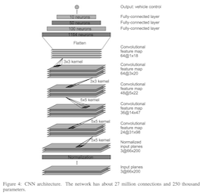
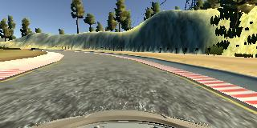

## The Solution

Nvidia model, plain and simple.

Image normalization was introduced in the model I had as explained by the
lecture videos. Apparently the reason for this is that the GPU can accelerate
the normalization greatly compared to preprocessing the data in a pipeline.
Sadly, keras has no bluring layer.

The 3 convlutional layers are meant to extract features from camera images.
Fully connected layers eventually end up with a single output: steering_angle.

All of this was determined empirically.

An additional layer was included, Cropping2D, to remove the hood and mountain
scenery from the input layer.

#### Specifics

Dropouts were not actually added. The 1164 layer of the Nvidia model was
also not used to prevent the model from being to complex. It seems like both
of these features had to be removed for the results to be achieved.

###### Denormalizing twice

Denormalizing happened on accident. The result was a model that made very weak
predictions about the value of the steering direction.

#### Data Set

Data set collected with
* 1 Lap in counter clockwise direction
* 1 Lap in clockwise direction
* 1 Lap with lots of recovery poses
* 1 Lap recording only the turns

Data collection was very rote. Previous attempts had many laps collected. the duplicate normalization really destroyed the model. It took a while before I
found out that my data was fine, it was the pipeline I had.

| Layer (type)  |  Output Shape | Param # | Connected to |
| --------------|-------------|---------|--------------|
|lambda_1 (Lambda)|(None, 160, 320, 3) |0|  lambda_input_1[0][0] |  
|cropping2d_1 (Cropping2D) | (None, 90, 320, 3)| 0 |lambda_1[0][0] |
|convolution2d_1 (Convolution2D) | (None, 86, 316, 24)|1824 |cropping2d_1[0][0] |
| maxpooling2d_1 (MaxPooling2D) | (None, 43, 158, 24) | 0 | convolution2d_1[0][0]|
|convolution2d_2 (Convolution2D)| (None, 39, 154, 36) | 21636 |maxpooling2d_1[0][0]|
|maxpooling2d_2 (MaxPooling2D)   | (None, 19, 77, 36) |   0 | convolution2d_2[0][0] |
| convolution2d_3 (Convolution2D) | (None, 15, 73, 48) |43248 | maxpooling2d_2[0][0]|
|maxpooling2d_3 (MaxPooling2D) | (None, 7, 36, 48) | 0 |convolution2d_3[0][0] |
|convolution2d_4 (Convolution2D) |  (None, 5, 34, 64)| 27712 |maxpooling2d_3[0][0]|
|maxpooling2d_4 (MaxPooling2D)   | (None, 2, 17, 64)  | 0 | convolution2d_4[0][0]|
| convolution2d_5 (Convolution2D) | (None, 2, 17, 64) | 4160 | maxpooling2d_4[0][0]|
|maxpooling2d_5 (MaxPooling2D)  |  (None, 1, 8, 64)   |   0   |convolution2d_5[0][0] |
|flatten_1 (Flatten) |(None, 512)| 0 |   maxpooling2d_5[0][0] |
| dense_1 (Dense)| (None, 100)| 51300| flatten_1[0][0]|
| dense_2 (Dense) | (None, 50)|5050|dense_1[0][0] |
|dense_3 (Dense)| (None, 10)| 510|dense_2[0][0] |
| dense_4 (Dense) | (None, 1)| 11| dense_3[0][0]|

* Total params: 155,451
* Trainable params: 155,451
* Non-trainable params: 0

##### Fears of Overfitting

| Epoch | Training Loss | Validation Loss |
|-------|----------|---------|
| 1 | 0.0230 | 0.0188|
| 2 |0.0166 | 0.0154|
| 3 | 0.0144| 0.0120|
|4 | 0.0129 | 0.0132 |

This table shows a typical number of epochs for training over 15837 images.
As you can see, training loss typically overestimates the validation loss, which
is an ad-hoc sign of overfitting. This is why I wanted to include Dropouts
and remove the densly connected 1164 input layer.
